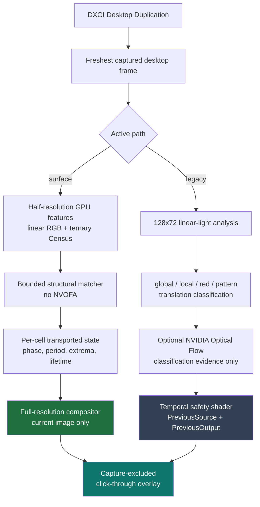
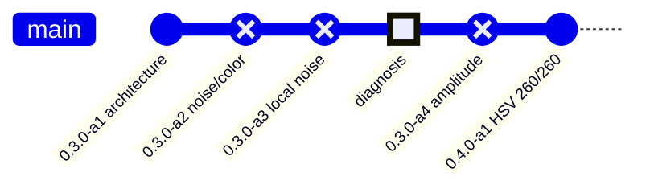

<div align="center">

# FlashGuard

**Experimental low-latency photosensitivity risk reduction for Windows**

A D3D11 overlay that captures the desktop, detects potentially hazardous flashing,
and limits displayed temporal modulation while trying to preserve ordinary motion.

[](https://github.com/Luci0n/FlashGuard/actions/workflows/build.yml)
[](https://github.com/Luci0n/FlashGuard/actions/workflows/gpu-smoke.yml)
[](CHANGELOG.md)
[](docs/SURFACE-FREQUENCY.md)

[](#build)
[](docs/ARCHITECTURE.md)
[](#build)
[](LICENSE.txt)

</div>

> [!WARNING]
> **Not medically validated, not clinically epilepsy-safe, not Harding FPA/PSE certified.**
> Passing FlashBench is an engineering regression result — not a medical guarantee,
> not formal accessibility certification, and not a promise of seizure prevention for
> any person or any stimulus. This is experimental software.

---

## Status

| | |
| --- | --- |
| **Version** | `0.4.0-alpha.4` |
| **Active development** | Surface-frequency path — current-frame-only, no NVOFA, no displayed-image feedback |
| **Release-build default** | Legacy NVOFA path (`--surface-frequency` opts in) |
| **Surface validation** | **260 / 260 checks pass** on an RTX 3060 |
| **Unresolved** | The one confirmed real-world artifact — see [live diagnosis](docs/OUTLAST-NOISE-DIAGNOSIS.md) |

As of `0.4.0-alpha.1` the surface-frequency path passes its complete validation for
the first time, including the moving white/red case at 5 Hz and 144 captured FPS that
all four preceding candidates failed. It reaches 74.17% against the **unchanged** 70%
requirement — the threshold was never relaxed to get there.

That is deterministic engineering evidence on one GPU. It does not establish that the
live speckle artifact recorded in the Outlast diagnosis is gone; that has not been
revalidated since.

---

## Processing pipeline



The two paths coexist in one executable and share capture and presentation. The
surface path composites from the **current image only**; the legacy path constrains
change against filtered history. Neither ever warps the displayed image with flow.

<details>
<summary><b>Why the legacy path keeps two separate histories</b></summary>

<br/>

| History | Contents | Used for |
| --- | --- | --- |
| `PreviousSource` | Previous **raw** desktop frame | Deciding whether a changed pixel is explained by motion |
| `PreviousOutput` | Previous **filtered** frame shown to the user | Constraining displayed change during an active hazard |

This separation is deliberate. Motion matching must not compare against an already
filtered image, and optical flow must never warp displayed history. Earlier failures
drove this: coarse masks produced visible shapes, unrestricted RGB history caused
trails, and flow-warped history produced rubber-sheet geometry deformation.

</details>

---

## Quick start

Requires Visual Studio 2022 with **Desktop development with C++**.

```powershell
# Legacy-default release build
.\scripts\build.bat release

# Or a build that defaults to the surface-frequency path
.\scripts\build.ps1 -Mode surface
```

```powershell
.\FlashGuard.exe                          # monitor under the mouse pointer
.\FlashGuard.exe --title "window title"   # monitor containing a window
.\FlashGuard.exe --validate-shaders       # compile every embedded HLSL entry point
```

| Build mode | Flags | Default path |
| --- | --- | --- |
| `fast` / `dev` | `/Od /Ob0` | Legacy |
| `release` | `/O2` | Legacy (`--surface-frequency` opts in) |
| `surface` | `/O2 -D FLASHGUARD_SURFACE_DEFAULT=1` | Surface (`--legacy` opts out) |

### Controls

| Key | Action |
| --- | --- |
| <kbd>F8</kbd> | Toggle the persistent manual neutral shield |
| <kbd>F9</kbd> | Toggle diagnostics |
| <kbd>F10</kbd> | Open / close the settings menu (<kbd>Esc</kbd> also closes) |
| <kbd>Ctrl</kbd>+<kbd>Shift</kbd>+<kbd>F12</kbd> | Exit |

Settings and hotkeys persist in `%LOCALAPPDATA%\OutlastFlashGuard\settings.ini`.

The settings menu is a compact 440×360 dark window with Home, Shortcuts, and Advanced
tabs. Menu opacity is adjustable from 60% to 100% (default 92%); protection output
opacity is unaffected. JetBrains Mono is embedded and loaded privately — no font
installation required. Menu and loading banner are excluded from capture.

Compiled shaders are cached in `%LOCALAPPDATA%\OutlastFlashGuard\shader-cache`, keyed
by source, entry point, target, flags, and compiler generation. In the recorded check
an 11-shader cold compile of **143.420 s** became a **0.324 s** cached load with zero
recompiles. That measures GPU and shader setup only, not full capture startup.

---

## Validation

The surface path is checked by `flashbench/surface-frequency.ps1` under
[`SURFACE_FREQUENCY_VALIDATION/1`](experiments/protocols/SURFACE-FREQUENCY-VALIDATION-1.md)
and its [HSV extension](experiments/protocols/HSV-CORRECTION-VALIDATION-1.md).

| Check | Result |
| --- | --- |
| Total checks | **260 / 260 pass** |
| HSV cases (5/10/20/30 Hz × 60/120/144 FPS) | 60 / 60 pass |
| Min HSV RGB variation reduction — settled | 99.24% |
| Min HSV RGB variation reduction — early | 99.38% |
| Moving white/red, 5 Hz @ 144 FPS | 74.17% *(requirement 70%)* |
| 1080p GPU draw time | p50 0.831 ms · p99 8.575 ms *(uncontrolled load)* |

> [!NOTE]
> GPU timings cover features, tracking, composite and total passes. Capture, copy,
> queueing, presentation and physical display delay are **excluded**. These are not
> end-to-end latency measurements, and no test ran under real game load.

### How it got here



| Version | Correction | Result |
| --- | --- | --- |
| `0.3.0-alpha.1` | First current-frame-only detector and compositor | 119/119 focused |
| `0.3.0-alpha.2` | Reject one-code dither; stop history inventing events | ❌ one case |
| `0.3.0-alpha.3` | Require local source change — 33.1964 → 0.00005 codes | ❌ one case |
| — | [Live diagnosis](docs/OUTLAST-NOISE-DIAGNOSIS.md): artifact is detector-introduced | ⚠️ unresolved |
| `0.3.0-alpha.4` | Bound correction by measured source amplitude | ❌ one case |
| `0.4.0-alpha.1` | Per-channel phase floor replaces grayscale projection | ✅ **260/260** |

Four consecutive candidates reported failure on the *same* case while each fixed a
real defect. The cause turned out to be a genuine bug — the grayscale projection was
*amplifying* saturation-only flashing, failing all 12 saturation cases by up to +53%
RGB variation — not a threshold artifact.

---

## 5–30 Hz flash sweep

24 two-second cases at 60 FPS across full-screen luminance, full-screen saturated red,
and quarter-screen luminance stimuli.

**Frequencies:** 5 · 7.5 · 10 · 12 · 15 · 20 · 25 · 30 Hz

The gate requires source stimuli above 3 flashes/s to be reduced to at most 3 counted
output flashes/s. On the self-hosted RTX 3060 run for commit `1802a4e6`, all 24 cases
produced **0.000** counted output general flashes/s and **0.000** counted red flashes/s.

| Frequency | Full-screen luminance | Quarter-screen luminance |
| ---: | ---: | ---: |
| 5 Hz | 77.88% | 69.07% |
| 10 Hz | 91.86% | 90.25% |
| 15 Hz | 96.60% | 93.01% |
| 20 Hz | 98.63% | — |
| 30 Hz | 98.63% | 95.93% |

The red-flash criterion is based on the red-flash transition counter, not on requiring
high luminance-modulation reduction — saturated red can be made safer by chromatic
mitigation even when screen-mean luminance changes less. This is standards-*oriented*
regression testing, not WCAG/Harding certification; the quarter-screen case uses a
simple screen-area stimulus, not a calibrated steradian laboratory measurement.

Informed by [WCAG 2.2 Three Flashes or Below Threshold](https://www.w3.org/WAI/WCAG22/Understanding/three-flashes-or-below-threshold)
and [ITU-R BT.1702](https://www.itu.int/rec/R-REC-BT.1702/).

---

## FlashBench

```powershell
powershell -ExecutionPolicy Bypass -File .\flashbench\run.ps1 `
    -Mode gpu-smoke -OutputDir .\flashbench\manual-results
```

Performs a release build, HLSL validation, real D3D11/NVOFA execution, deterministic
synthetic replay through the same safety path, motion/ghosting and camera-pan
regressions, and the 5–30 Hz sweep.

| Report | Contents |
| --- | --- |
| `summary.json` | Overall run result |
| `nvof-smoke.json` | Real NVOFA execution evidence |
| `synthetic-replay.json` | Deterministic replay metrics |
| `flash-sweep.json` | Per-case sweep gates |
| `flashbench.log` | Full run log |

<details>
<summary><b>Visual replay</b> — inspect the synthetic cases yourself</summary>

<br/>

```powershell
powershell -ExecutionPolicy Bypass -File .\flashbench\run.ps1 `
    -Mode gpu-smoke -OutputDir .\flashbench\manual-results -VisualReplay

Start-Process .\flashbench\manual-results\visual\index.html
```

The viewer shows sampled replay frames as `SOURCE | FILTERED | 6× AMPLIFIED DIFFERENCE`,
covering the 15 Hz flash, straight and oblique bright motion, small-object motion, and
camera pan.

</details>

<details>
<summary><b>Legacy detector defaults</b> — engineering values, not medical thresholds</summary>

<br/>

| Parameter | Value | | Parameter | Value |
| --- | ---: | --- | --- | ---: |
| `lookaheadMs` | 0 | | `flashEnergyThreshold` | 0.030 |
| `localDeltaThreshold` | 0.10 | | `smallFlashAreaThreshold` | 0.008 |
| `globalDeltaThreshold` | 0.16 | | `smallFlashDeltaThreshold` | 0.25 |
| `affectedAreaThreshold` | 0.18 | | `smallFlashCoherenceThreshold` | 0.85 |
| `strongAffectedArea` | 0.30 | | `spillExpansionCells` | 4 |
| `globalAreaThreshold` | 0.90 | | `localGlobalSupportThreshold` | 0.035 |
| `coherenceThreshold` | 0.70 | | `safeRiseRate` | 1.35 luma/s |
| `visualFieldAreaThreshold` | 0.25 | | `safeFallRate` | 1.60 luma/s |
| `patternScoreThreshold` | 0.24 | | `minimumProtectionTime` | 0.22 s |
| `cameraMotionSuppression` | 0.32 | | `releaseTime` | 0.45 s |
| `redThreshold` | 0.55 | | `displayDiagonalInches` | 27 |
| `redDeltaThreshold` | 0.18 | | `viewingDistanceCm` | 70 |
| `redAffectedAreaThreshold` | 0.15 | | `overloadWhiteCeiling` | 0.72 |
| `redDesaturation` | 0.68 | | `subtleToneMap` | true |
| `blackFloor` | 0.08 | | `whiteCeiling` | 0.84 |

The surface-frequency detector uses **fixed** 5–30 Hz parameters; these legacy
sensitivity and profile settings do not tune it.

</details>

---

## Documentation

| Document | Covers |
| --- | --- |
| [`ARCHITECTURE.md`](docs/ARCHITECTURE.md) | Legacy path — capture, detection, temporal filtering, motion |
| [`SURFACE-FREQUENCY.md`](docs/SURFACE-FREQUENCY.md) | Current path, correction history, validation |
| [`SOLUTION-2026-09-05.md`](docs/SOLUTION-2026-09-05.md) | Design review the current path implements |
| [`TESTING.md`](docs/TESTING.md) | Methodology, protocols, reproducibility, gaps |
| [`VERSIONING.md`](docs/VERSIONING.md) | Software / protocol / run versioning and immutability |
| [`OUTLAST-NOISE-DIAGNOSIS.md`](docs/OUTLAST-NOISE-DIAGNOSIS.md) | The unresolved real-world artifact |
| [`docs/releases/`](docs/releases/) | Notes shipped with each test package — historical, not current |
| [`experiments/`](experiments/) | Immutable raw records, **including failed runs** |
| [`CHANGELOG.md`](CHANGELOG.md) | Public version history |

## Repository layout

| Path | Contents |
| --- | --- |
| `src/` | C++ and embedded HLSL — `analysis/`, `shaders/`, `render/`, `ui/` |
| `assets/` | Embedded fonts and licenses |
| `scripts/` | Windows build entry points |
| `flashbench/` | GPU smoke, replay, visual viewer, regression automation |
| `docs/` | Architecture, testing, versioning |
| `experiments/` | Protocols and archived raw results |
| `.github/workflows/` | Hosted build and self-hosted GPU CI |

## Automated CI

On pushes to `test`: [`build.yml`](.github/workflows/build.yml) runs a hosted Windows
release build with HLSL validation, and [`gpu-smoke.yml`](.github/workflows/gpu-smoke.yml)
runs on the self-hosted runner labeled `flashguard-gpu`. Successful GPU runs publish
per-commit artifacts containing the machine-readable reports.

---

## Known limitations

- Reduces measured temporal modulation in its regression corpus; **cannot guarantee seizure prevention** for every person or stimulus.
- The live speckle artifact in [`OUTLAST-NOISE-DIAGNOSIS.md`](docs/OUTLAST-NOISE-DIAGNOSIS.md) was traced to temporal detection but **remains unresolved**, and has not been revalidated since the synthetic suite began passing.
- Desktop Duplication and Windows composition impose latency even on the waitable low-latency path.
- Real gameplay can expose motion/content combinations absent from deterministic synthetic cases.
- On the surface path, provisional attenuation can affect ordinary color changes before a frequency is confirmed.
- The legacy local motion fallback is deliberately bounded; unusual large or complex local motion can be misclassified.
- NVOFA availability depends on supported NVIDIA hardware, driver, and runtime.
- Luminance/chroma limiting can alter colors, highlights, shadows, and perceived contrast.
- Display-size and viewing-distance calibration is approximate.
- Pattern detection and the flash sweep are **not** Harding FPA/PSE certification implementations.
- The detector can miss stimuli below its spatial, temporal, color, or luminance thresholds.

---

<div align="center">
<sub>MIT licensed · Experimental risk-reduction software · Not a medical device</sub>
</div>
